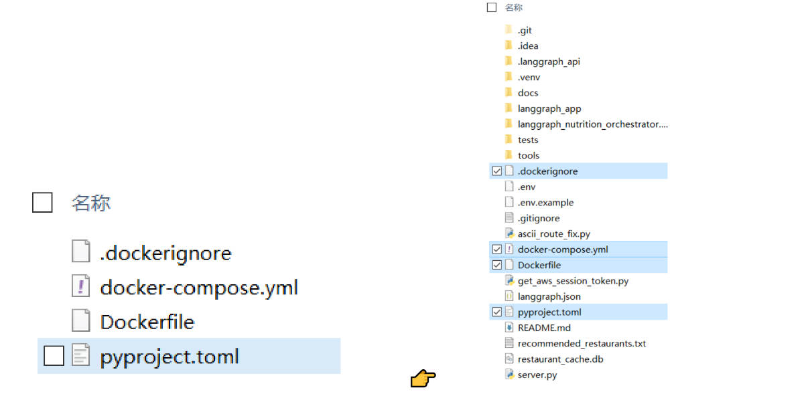

# For using Docker containers for testing and deployment, you need to:
1. ***Unzip dockerfiles.zip***


2. ***Place the file in your own project root directory in the EC2 instance***


3. ***Run command line***
```
docker-compose up -d --build
```

4. ***Check the running status of the docker container <span style="color:red;">and pay attention to port conflicts(default 2024)</span>***
```
docker-compose ps # View process status

docker-compose logs (-f) # View running logs (-f for real-time viewing)

docker-compose down # Close the container (not manually closing it will occupy the port)
```
---
## Tips
* When building a Docker image, please ensure that the host: container port set in docker-compose.yml is not in use, otherwise an error will be reported.(It can be port 2024, but make sure it is not currently in use)
* When you build the image and start the container, please also pay attention to the issue of port occupation, otherwise an error will be reported.